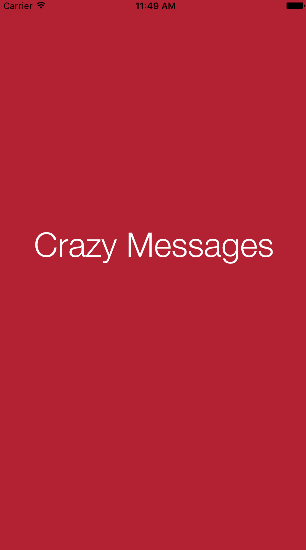

## CrazyMessages

Sample iOS app that implements [XMPPFramework](https://github.com/robbiehanson/XMPPFramework). The intention of this repository is to provide the functional code written in the "Build a complete iOS messaging app using XMPPFramework" blog posts series.

### Blog posts:

+ [YAXT??! Yet another XMPP tutorial?](https://www.erlang-solutions.com/blog/build-a-complete-ios-messaging-app-using-xmppframework-tutorial-part-1.html)
+ [First steps: XMPPFramework](https://www.erlang-solutions.com/blog/build-a-complete-ios-messaging-app-using-xmppframework-part-2.html)

## App Status

**So far the app implements:**

1. XMPPFramework Integration.
2. XMPP Connection and Authentication.

**Next steps:**

1. Roster retrieval. Add contacts, remove contacts.
2. Messages. Send and receive one to one messages.
3. MUCLight vs MUC. Create your own WhatsApp like groups.
